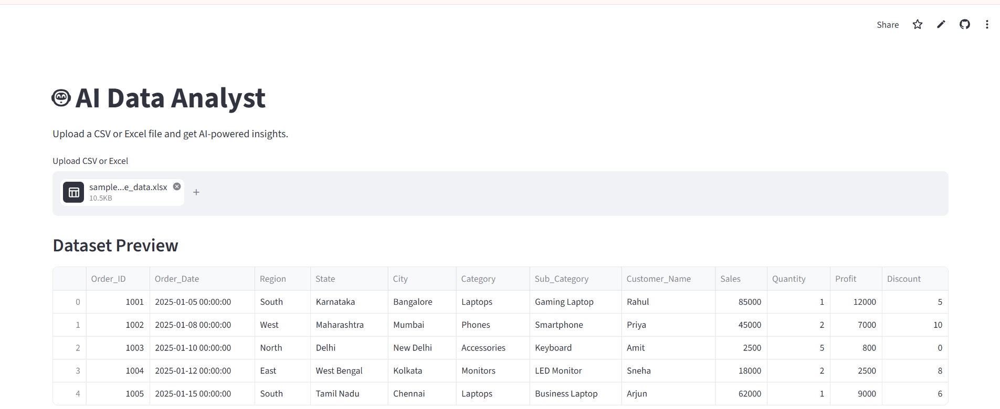

# 📊 Chart Generator - Data Visualization App

A Python-based interactive **Chart Generator** built using **Streamlit** that allows users to upload datasets and create visualizations easily. The application helps users explore data through different charts without writing any visualization code.

## 🚀 Live Demo

🔗 Streamlit App:
https://chartgeneratorpy-gn3sbaeritjemeybet45wb.streamlit.app/

---

## 📸 Application Preview



---

## 📌 Features

- 📂 Upload CSV files
- 📊 Generate interactive charts
- 📈 Multiple visualization options
- 🔍 Quick data exploration
- 🖥️ User-friendly Streamlit interface
- ⚡ No coding required for visualization

---

## 🛠️ Technologies Used

- Python
- Streamlit
- Pandas
- NumPy
- Matplotlib
- Seaborn
- Plotly

---

## 📂 Project Structure

```
Chart-Generator/
│
├── app.py
├── dashboard.png
├── requirements.txt
└── README.md
```

---

## ⚙️ Installation & Setup

Clone the repository:

```bash
git clone <your-github-repository-url>
```

Navigate to the project folder:

```bash
cd Chart-Generator
```

Install dependencies:

```bash
pip install -r requirements.txt
```

Run the application:

```bash
streamlit run app.py
```

---

## 📊 How It Works

1. Upload a CSV dataset
2. Select the required visualization type
3. Choose columns for analysis
4. Generate charts instantly
5. Explore insights visually

---

## 🎯 Use Cases

- Data analysis projects
- Business reporting
- Exploratory Data Analysis (EDA)
- Learning data visualization
- Quick dashboard creation

---

## 👩‍💻 Author

**Sushma Rakesh**

GitHub:
https://github.com/sushmarakesh17
